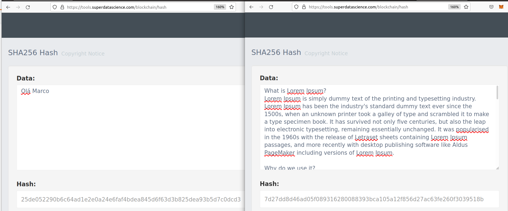
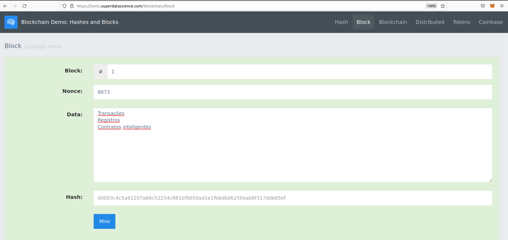
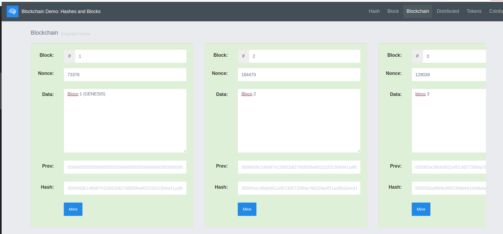
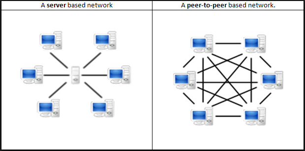
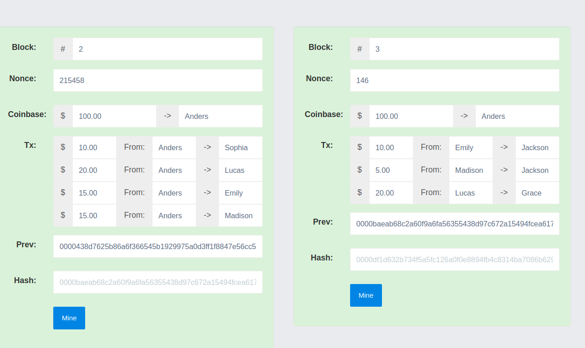

# Fundamentos e conceitos de Blockchain

## O que é o blockchain?

Conceito dado inicialmente por Stuart Haber e W. Scott Stornetta com artigo "How to timestamp a digital document".
Definido como uma lista crescente de registros (transações, contratos inteligentes) formada por blocos, e na
qual esses blocos estão conectados por criptografia (algoritmos hash) e pelo consenso da rede (protocolo do consenso).

A tecnologia blockchain é baseada em fundamentos e técnicas desenvolvidas anteriormente tais como Criptografia e algoritmos de HASH, redes decentralizadas e protocolo de concenso.

Camadas de segurança no blockchain:
    * Criptografia Hash.
    * Redes distribuidas (P2P) e algoritmos de consenso.

<h2 style="color:red">Criptografia</h2>

### Conceitos basicos de criptografia

    Algoritmos Hash
    Chaves públicas e privadas

<h2 style="color:red">Criptografia</h2>

### Algoritmos HASH e SHA256 (Secure Hash Algoritm)
Trata-se conceitualmente de uma impressão digital para informação digital.
O algoritmo foi desenvolvido pela NSA (National Security Agency) e posteriormente tornado opensource. Trata-se de uma função que recebe como entrada dados binarios, tais como textos, documentos, softwares, images, videos e todo tipo de informação digital. E ao final devolve um HASH no formato hexadecimal e de tamanho 64 (256 bits).

    Exemplo de SHA256: 06655b009c64144d7aafdec85198abafe92613891839280833b5d678fd1a2e26

Pode ser usado para por exemplo garantir a integridade de dados baixados na internet, pois caso o Hash SHA256 do pacote localizado no servidor for diferente do hash SHA256 do pacote após o download, significa que esse pacote pode ter sido corrompido no caminho, seja por falha ou por ação de um terceiro malicioso.

O hash SHA256 pode ser testado através da aplicação [Super Data Science Tools Aba Hash](https://tools.superdatascience.com/blockchain/hash), onde um layout como mostrado nas figuras abaixo é disponibilizado.

O algoritmo SHA256 tem a capacidade de "hashear" uma quantidade enorme de dados. O limite matemático é de 2⁶⁴ bits, gerando sempre na saída um número hexadecimal de tamanho 64.

### Características essenciais do algoritmo SHA256

* **1. Sem retorno:** Com o hash em mão não é possivel descobrir ou restaurar a informação original de entrada.
* **2. Determinístico:** A mesma entrada sempre gerará o mesmo hash de saída.
* **3. Processamento rápido:** Requisito para que aplicações baseadas no SHA256 funcionem com eficiência.
* **4. Efeito Avalanche:** A menor alteração em dados de entrada geram um hash totalmente diferente.
* **5. Suporte a colisões:** Multiplas entradas podem gerar o mesmo hash256 (colisão natural). Porém, pela característica do hash de ter 2⁶⁴ valores diferentes faz com que seja improvável uma colisão maliciosa.

Para mais detalhes, ler o artigo [On the Secure Hash Algorithm family (Chapter 1 of Cryptography in Context)](https://www.staff.science.uu.nl/~tel00101/liter/Books/CrypCont.pdf) 

<h2 style="color:red">Blocos (Unidade de uma cadeia de blocos)</h2>

É uma estrutura de dados com o formato básico:

    1. Número do bloco: 1
    2. Nonce:           1745
    3. Dados:           Qualquer tipo de dados
    4. Hash:            00004d7aafde***514a15d1

* **Numero do bloco:** Identifica o numero daquele bloco na rede.
* **Nonce:** Campo que é alterado no bloco para torná-lo válido. Consiste um numero inteiro que quando encontrado torna o hash do bloco válido, de acordo com uma regra estipulada. Por exemplo: O hash do bloco deve começar com 4 zeros a esquerda.
* **Dados:** Campo que carrega todas as informações referentes aos dados de transações, contratos inteligentes e outros tipos.
* **Hash:** Campo calculado ao se aplicar o algoritmo SHA256 ou outro algoritmo de hash similar sobre os dados definidos acima.

### Exporando a fundo conceitos da mineração de blocos

#### Nonce

#### Quebra cabeça Criptográfico

A ação de minerar um bloco (torná-lo válido) consiste na resolução de um **quebra-cabeças criptográfico** que consiste em encontrar um número NONCE que faça com que o HASH do bloco tenha determinada característica. Esse tipo de problema é conhecido por ser extremamente dificil de resolver (a depender do objetivo). Porém, após ser resolvido, a verificação da resposta correta é de verificação extremamente fácil.

O comportamento e validação de um bloco pode ser explorado em [Super Data Science Tools Aba Block](https://tools.superdatascience.com/blockchain/block), onde um layout como mostrado nas figuras abaixo é disponibilizado.

Conclusão: 

<h2 style="color:red"> Registros Imutáveis (Immutable Ledger)</h2>

Registro imutáveis são formados a partir do conceito de que cada bloco possui um **HASH** (uma assinatura de seus dados) e esse valor é adicionado como propriedade no bloco posterior, com nome **HASH ANTERIOR**. Dessa forma, baseado no efeito avalanche do SHA256, caso esse bloco sofra alguma alteração na informação, por menor que seja, ele perde o link com todos os blocos posteriores, visto que o seu "hash" não é mais o mesmo do "hash anterior".

Uma aplicação de registros imutáveis pode ser explorada através da aplicação [Super Data Science Tools Aba Blockchain](https://tools.superdatascience.com/blockchain/blockchain), onde um layout como mostrado nas figuras abaixo é disponibilizado.

Portanto, caso alguem altere um registro, toda cadeia de blocos posterior é corrompida. Logo para essa alteração ser bem sucedida, é necessário se mudar todos os registros posteriores, de modo a ela se tornar válida novamente.

Para mais detalhes, ler o artigo [The meaning of Descentralization](https://medium.com/@VitalikButerin/the-meaning-of-decentralization-a0c92b76a274) de Vitalik Buterin (2017).

<h2 style="color:red">Redes P2P (Peer to Peer)</h2>

Entre as Topologias de rede mais conhecidas se encontra a rede Client-Server e a rede P2P (peer to peer).
* **Arquitetura Client-Server:** Um servidor central responde a requisições de clientes.
* **Arquitetura P2P:** Não há um nó central. Cada nó da rede se comunica com todos os outros.

Em uma rede P2P o blockchain inteiro é cópiado para cada um dos nós da rede. Porém, caso algum desses nós decida adulterar algum registro de transação específico seu blockchain e validar todos os blocos posteriores do blockchain em sua máquina, pelas características da rede P2P e uma constante verificação de Integridade do blockchain feita pela rede a partir do HASH de cada bloco, o que acontece é o seguinte:

Os outros nós da rede conseguem identificar que aquele nó em específico não possui um blockchain íntegro. Isso porque, mesmo que o hacker tenha mineirado todos os blocos posteriores, tornando o seu blockchain agora valido, ele não é mais compatível com as versões presentes no restante dos nós da rede.

É então enviada uma ordem para substituir o bloco malicioso pelo blockchain considerado íntegro pela rede. Portanto, é necessário atacar 50% + 1 dos nós da rede para que um ataque seja bem sucedido, trazendo alta confiabilidade aos dados de uma blockchain, pois os registros inseridos nela se tornam praticamente imutáveis.
Essa arquitetura de rede P2P oferece vantagens tais como:
    

<h2 style="color:red">Mineração no blockchain</h2>

O processo de mineração consiste na busca pela solução de um quebra-cabeça que gere um HASH para o bloco de acordo com um padrão pré-estabelecido. Um desses padrões poderia ser encontrar um HASH para o bloco que inicie com 4 zeros, ou 16 zeros.
A solução do quebra-cabeça criptográfico, como foi citado anteriormente, é dado pelo campo **NONCE**

### Nonce
O Nonce remete ao campo de um bloco que deve ser do tipo numérico e inteiro.

### Quebra-cabeça criptográfico

Um HASH é um número Hexadecimal. Ele possui todas as propriedades de um número decimal (operações aritméticas, de comparação e outras).
O quebra-cabeça criptográfico se baseia na probabilidade de um HASH seguir um determinado padrão.

* **Exemplo:** Para resolver o quebra-cabeças para minerar um bloco de Dadaiacoin consistem em encontrar um HASH SHA256 que comece com 4 digitos a esquerda.
* **Exemplo de hash Objetivo:** 0x00005b009c64144d7aafdec85198abafe92613891839280833b5d678fd1a2e26
* **Estratégia para resolver:** Visto que os outros campos do bloco não podem ser alterados, deve-se trabalhar no campo **NONCE**, gerando diferentes valores do tipo inteiro até que o HASH gerado a partir da combinação de todos os outros campos do bloco com o NONCE tenha o objetivo descrito

* **Dificuldade:** No caso citado, a chance de encontrar o NONCE é de 16⁴.

#### Conclusão:

Na tecnologia blockchain a mineração de um novo bloco para a rede é feita com a premissa de que existe um problema a ser resolvido (quebra-cabeças criptográfico). Ele se define como encontrar um valor para o campo **Nonce** que gere um HASH para o bloco que solucione o quebra-cabeças.

## Chaves públicas e Privadas

## Certificados e assinaturas digitais
Assinatura digital que garante a autenticidade de quem faz uma transação

## Teoria e algoritmos de de consenso

### Problema do Ataque Bisantino e abstração do que um algoritmo de consenso precisa resolver

Descrito por Satoshi Nakamoto em seu artigo Bitcoin E-Cash para simular uma rede P2P.
Problema: Existe um cerco de generais a um castelo e esses generais possuem tropas. Eles se encontram em um estado de combate, prontos para atacarem o castelo assim que surgir uma ordem para atacar ou recuar. Para conquistar a batalha é preciso que pelo menos 75% das tropas ataquem ao mesmo tempo.
A operação militar pode ser bem sucedida somente se houver um grande consenso entre as tropas, seja para atacar, seja para recuar e atacar no próximo dia. Pode-se materializar isso imaginando que se 70% recuar e 30% atacar, ou vice-versa, o exercito perderá a batalha e não terá mais tropas para atacar futuramente.
A ordem para ataque surge de um general, que por ocasião se torna o general lider.
Entre os generais, existem 2 tipos:
    Os generais honestos, que ao receberem uma decisão de atacar ou recuar a repassam corretamente as suas tropas.
    Os generais subornados pelo reino que está sendo atacado, que ao receberem uma decisão de atacar ou recuar, passam a informação contrária a suas tropas
Abstração do problema do Ataque Bisantino

### Consenso de Nakamoto ou Proof of work (PoW)
A cada nó minerado, um nó é escolhido para minerar um bloco (Poder de uma rede descentralizada)
Deve-se resolver 

Como descobrir o lider do bloco?
Quebra-cabeça criptografico (Dificil de resolver e facil de verificar)

Regras para recompensa e geração de escassez

1 nó cria e os outros validam

Desvantagens Do uso de do PoW
    - Gasto energético

#### Pools de mineração

### Ataque dos 51%
Copia de um blockchain com 51% do poder computacional total da rede distribuida.

Quantidade de energia para ataque 51%
## Consumo de energia

Abstração
### Proof of stake (PoS)

Lider do bloco (nó que minera um novo bloco para a rede) é eleito de acordo um regulamento especifico.
Pega-se tokens e coloca-se como garantia para caso o lider dê o tumé

Mais dificil de reverter ataque de 51% (quem tem mais de 51% das moedas da rede)

### Outros algoritmos de consenso
Redes blockchain privadas:
    - Pratical Bizantine fault tolerance
    - Proof of Authority
    - Proof of Burn

Bizantine Failure (Not Fail Stop)
    - Nós traidores mandando mensagens conflitantes, seja por falha, seja por um agente terceiro malicioso.
    Extrema tolerancia a falhas.
    Bitcoin
    Controladores de vôo Boing 777 e 787
    Artigo: The Bizantine Generals problem, Leslie Lamport, Robert Shostack and Marshal Peace - 1982
    Problemas abordados no artigo: 
        - A quantas falhas bizantinas em nós um sistema descentralizado pode sobreviver
        - Como poderia ser construido um sistemas tolerante a falhas bizantinas.

    Problema para 1
    Problema para 2
    Problema para 3: Não a solução para o caso de 1 traidor.
    Conclusão do artigo: Não a solução para 3m + 1 generais com m traidores

### Mempools

## Processo de mineração
Desafio do Bitcoin:
Premio do Bitcoin: Variavel

Hardware: CPUs, GPUs e 
### Mineradoras

### Mining Pools

<h1 style="color:red">Blockchains Privadas</h1>

### Topologias

#### Redes publicas 

Bitcoin
Etherium

#### Redes privadas (Permissioned Networks)

Hyperledge Fabric
Ripple

### Proof of work (PoW)